# Jarkom-Modul-1-F06-2023

Kelompok F06:
- Arkana Bilal Imani / 5025211034
- Azhar Abiyu Rasendriya H. / 5025211177

# No. 1
### Soal
User melakukan berbagai aktivitas dengan menggunakan protokol FTP. Salah satunya adalah mengunggah suatu file.  
a. Berapakah sequence number (raw) pada packet yang menunjukkan aktivitas tersebut?

b. Berapakah acknowledge number (raw) pada packet yang menunjukkan aktivitas tersebut? 

c. Berapakah sequence number (raw) pada packet yang menunjukkan response dari aktivitas tersebut?

d. Berapakah acknowledge number (raw) pada packet yang menunjukkan response dari aktivitas tersebut?

### Penyelesaian
Untuk mengetahui packet yang dikirim/diterima menggunakan FTP bisa menggunakan display filter `ftp`  
  
Namun untuk mendapatkan packet yang secara spesifik hanya bisa dikirim dengan FTP, dapat menggunakan display filter `ftp contains "STOR"` karena command STOR hanya bisa dilakukan melalui FTP  
  
Setelah packet didapatkan, tinggal dilihat sequence number (raw) dan acknowledgement number (raw) dengan membuka section Transmission Control Protocol seperti berikut:  
  
Untuk mendapatkan packet response, display filter yang digunakan adalah `ftp contains "zip"` karena command STOR digunakan untuk upload file zip.  
  
Perolehan flag:  
  
Kendala: tidak ada.  

# No. 2
### Soal
Sebutkan web server yang digunakan pada portal praktikum Jaringan Komputer!

### Penyelesaian
Untuk menemukan portal praktikum Jaringan Komputer masukkan display filter `http contains “jar”` karena kata kunci jaringan komputer/jarkom.
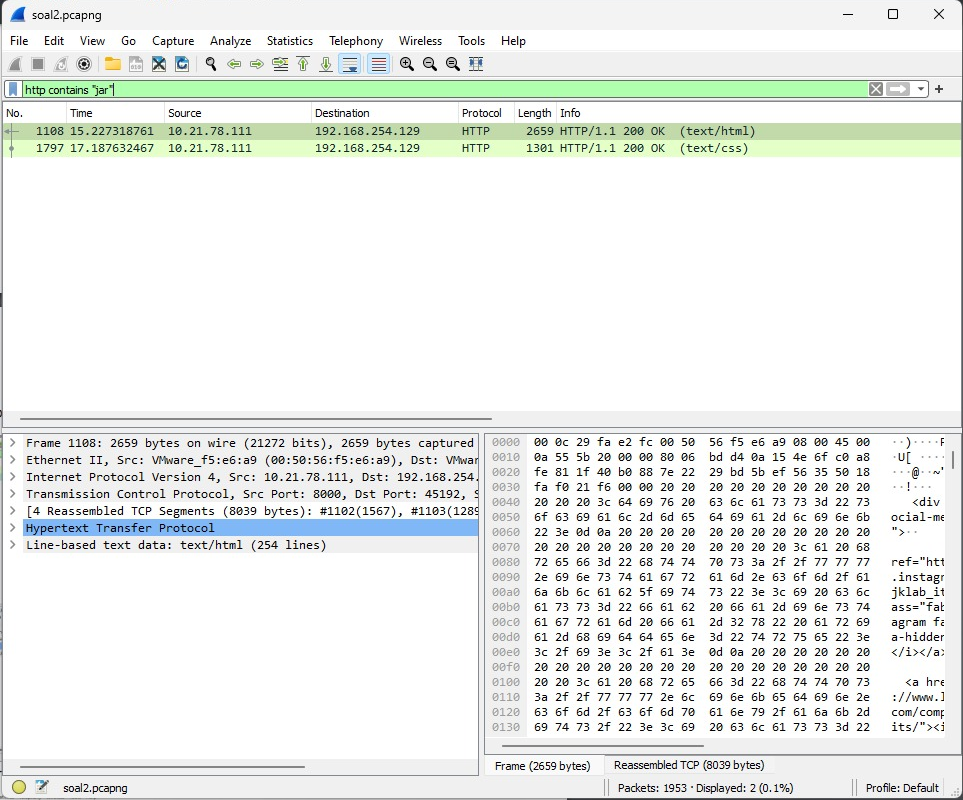

Untuk menemukan web server yang digunakan buka http stream dari packet yang sudah difilter.
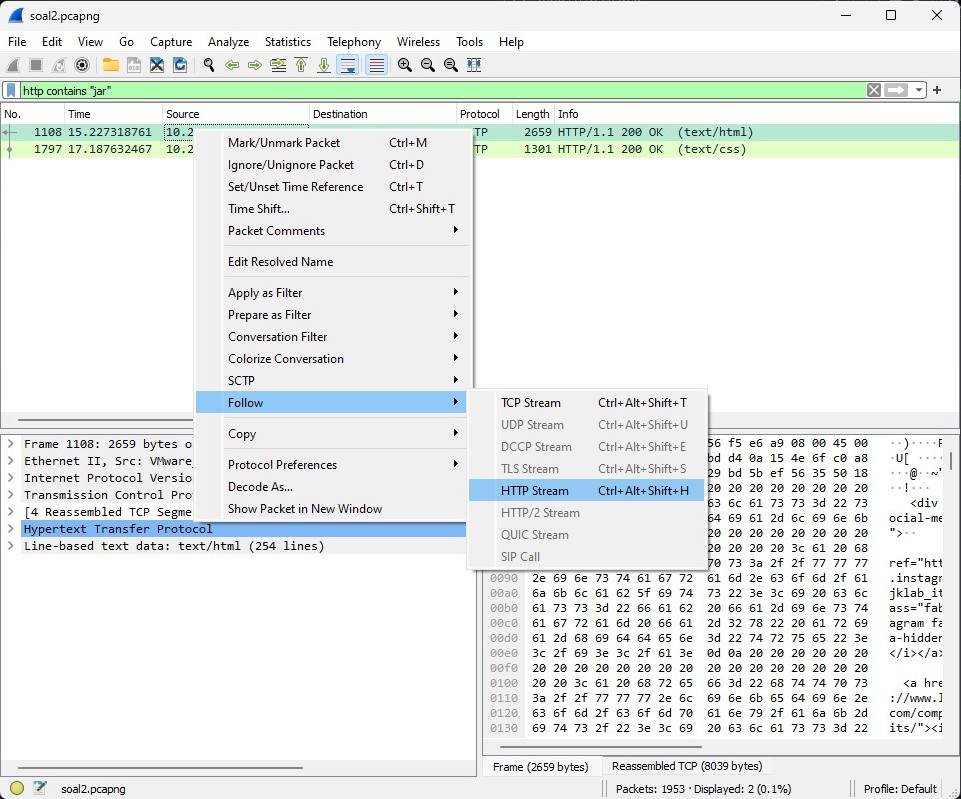

Mengambil nama gunicorn dari http stream tersebut.
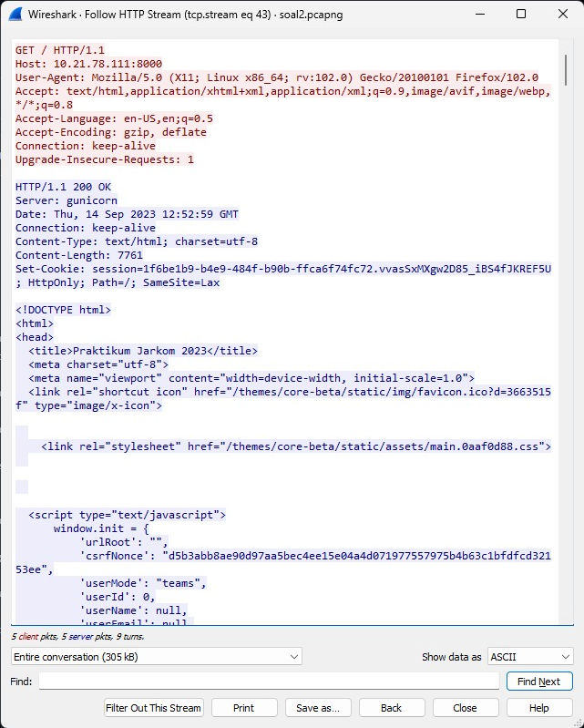

Perolehan flag :

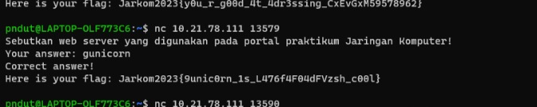

Kendala : tidak ada.

# No. 3
### Soal
Dapin sedang belajar analisis jaringan. Bantulah Dapin untuk mengerjakan soal berikut:

a. Berapa banyak paket yang tercapture dengan IP source maupun destination address adalah 239.255.255.250 dengan port 3702?

b. Protokol layer transport apa yang digunakan?

### Penyelesaian
Untuk menemukan paket yang tercapture dengan IP source maupun destination address 239.255.255.250, masukkan display filter `ip.src == 239.255.255.250 or ip.dst == 239.255.255.250`
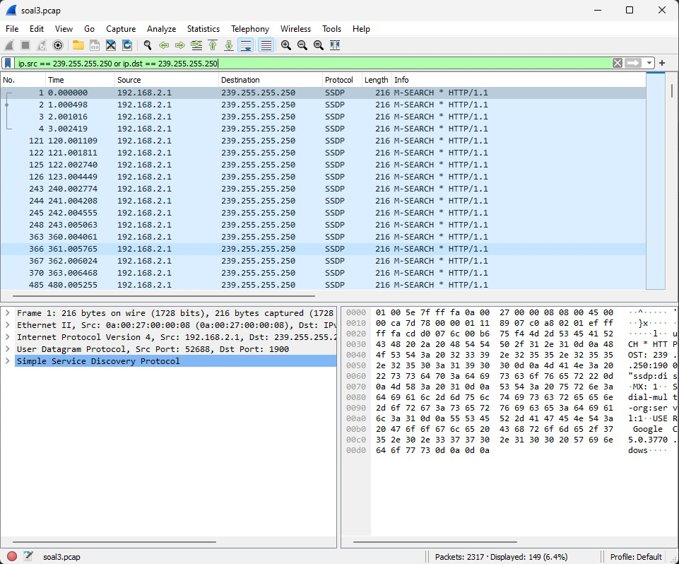

Sort berdasarkan protocol untuk menggrup protocol udp
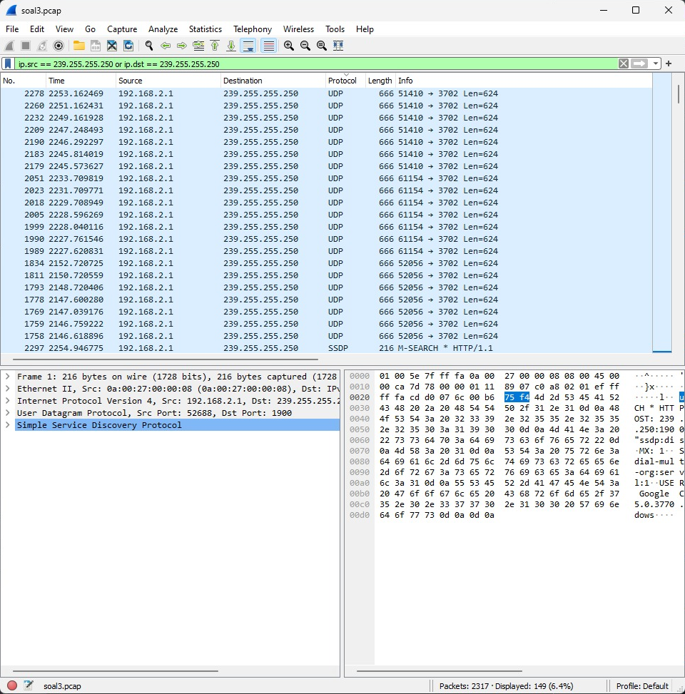

Perolehan flag :

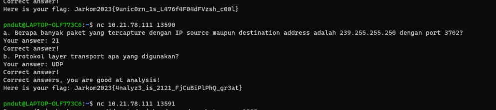

Kendala : tidak ada.

# No. 4
### Soal
Berapa nilai checksum yang didapat dari header pada paket nomor 130?

### Penyelesaian
Untuk nilai checksum yang didapat dari header pada paket nomer 130, buka paket urutan atau nomer 130 dan dibuka User Datagram Protocolnya
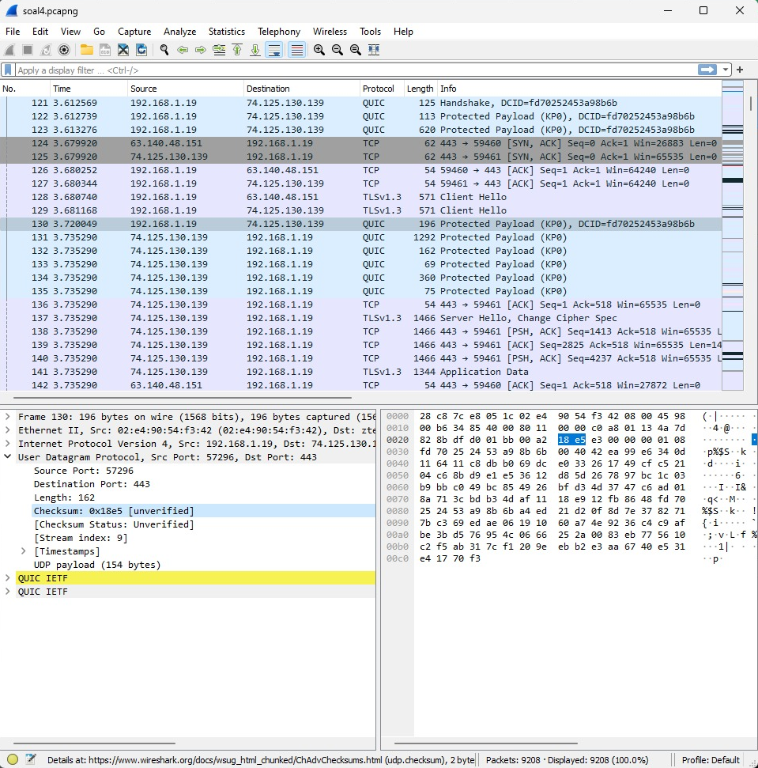

Ditemukan nilai checksum yaitu `0x18e5`

Perolehan flag :

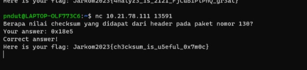

Kendala : tidak ada.

# No. 5
### Soal
Elshe menemukan suatu file packet capture yang menarik. Bantulah Elshe untuk menganalisis file packet capture tersebut.  
a. Berapa banyak packet yang berhasil di capture dari file pcap tersebut?

b. Port berapakah pada server yang digunakan untuk service SMTP?

c. Dari semua alamat IP yang tercapture, IP berapakah yang merupakan public IP?

### Penyelesaian
Karena soal tidak memberikan command netcat, langsung saja masuk ke file pcap yang diberikan. Untuk memperjelas isi dari paket paket, seperti biasa buka TCP stream.  
  
Didapatkan message berikut yang berisi password dan pesan.  
  
Kita decode passwordnya dengan website base64 decoder.  
  
Lalu gunakan password yang sudah didecode untuk membuka file.zip yang diberikan soal.  
  
Didapatkan command netcat seperti berikut:  
  
Untuk pertanyaan pertama, ada 60 paket dalam file pcap yang bisa langsung dihitung seperti berikut:  
  
Untuk pertanyaan kedua, bisa menggunakan display filter `smtp` untuk memperlihatkan packet SMTP saja. Bisa dilihat bahwa SMTP menggunakan port 25.  
  
Untuk pertanyaan ketiga, salah satu kolom IP bisa disort untuk mengelompokkan IP. Dapat dilihat bahwa ada 3 IP, yaitu yang dimulai dengan 10, 192, dan 74. Karena IP yang dimulai dengan angka 10 dan 192 pada umumnya adalah IP privat, maka jawabannya adalah IP yang dimulai dengan 74.  
  
Perolehan flag:  
  
Kendala: tidak ada.  

# No. 6 (Revisi)
### Soal
Seorang anak bernama Udin Berteman dengan SlameT yang merupakan seorang penggemar film detektif. sebagai teman yang baik, Ia selalu mengajak slamet untuk bermain valoranT bersama. suatu malam, terjadi sebuah hal yang tak terdUga. ketika udin mereka membuka game tersebut, laptop udin menunjukkan sebuah field text dan Sebuah kode Invalid bertuliskan **"server SOURCE ADDRESS 7812 is invalid"**. ketika ditelusuri di google, hasil pencarian hanya menampilkan **a1 e5 u21**. jiwa detektif slamet pun bergejolak. bantulah udin dan slamet untuk menemukan solusi kode error tersebut.  
### Penyelesaian
Karena di soal diberi clue **SOURCE ADDRESS 7812**, maka dapat digunakan display filter `frame.number == 7812` untuk memperlihatkan packet nomer 7812.  
  
Source address yang dimaksud adalah source IP yang bernilai `104.18.14.101`  
Menggunakan clue soal **a1 e5 u21** yang merupakan bagian dari cipher, dicoba untuk memasukkan angka source IP tersebut ke dalam translator.  
  
Didapatkan kode error `JDRNJA`  

Perolehan flag:  
  

Kendala: clue soal **a1 e5 u21** tidak terlalu deskriptif dan misleading karena kode error yang benar di akhir menggunakan huruf kapital.  

# No. 7
### Soal
Berapa jumlah packet yang menuju IP 184.87.193.88?  

### Penyelesaian
Kita cukup menggunakan display filter berikut `ip.dst == 184.87.193.88` dimana .dst berarti destination yang menandakan bahwa yang dicari adalah IP tujuan.
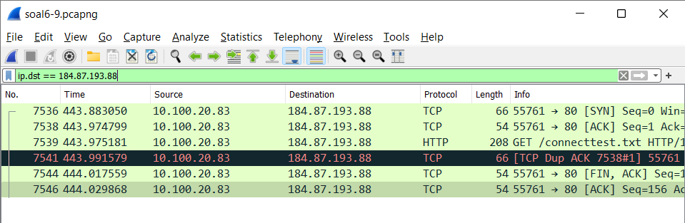  
Dapat langsung dihitung bahwa ada 6 packet yang menuju IP tersebut.  

Perolehan flag:  
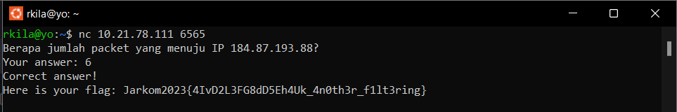 

Kendala : tidak ada.

# No. 8
### Soal
Berikan kueri filter sehingga wireshark hanya mengambil semua protokol paket yang menuju port 80! (Jika terdapat lebih dari 1 port, maka urutkan sesuai dengan abjad)

### Penyelesaian
Dapat menggunakan display filter sebagai berikut `tcp.dstport == 80 || udp.dstport == 80`. Mengapa harus menggunakan `tcp.` dan `udp.`? karena tidak ada display filter yang hanya menarget port ataupun port tujuan. Yang bisa ditarget sebelumnya adalah protokol terlebih dahulu, lalu port. Maka dari itu `tcp.` dan `udp.` digunakan dan diberi ekspresi `||` untuk menginclude semua protokol yang ada.  
`dstport` disini memiliki arti destination port atau port tujuan.  
Wireshark akan mensortir packet secara abjad secara otomatis, maka dari itu tidak perlu dimasukkan ke display filter.
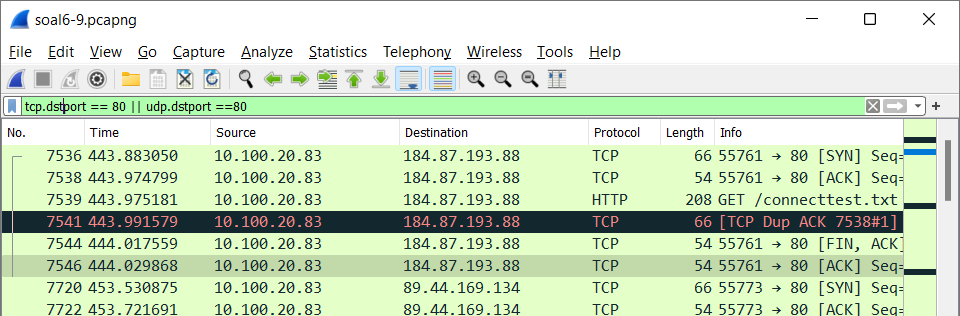

Perolehan flag:  
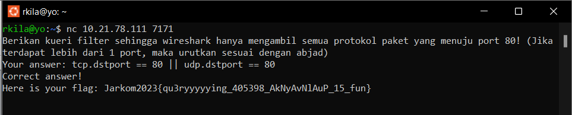

Kendala: pengecekan sintaks yang restrictive karena sebenarnya penggunaan `or` dan `eq` juga benar. Apabila spasi dihilangkan dari jawaban, juga akan terhitung benar di Wireshark.  

# No. 9
### Soal
Berikan kueri filter sehingga wireshark hanya mengambil paket yang berasal dari alamat 10.51.40.1 tetapi tidak menuju ke alamat 10.39.55.34!

### Penyelesaian
Menggunakan display filter `ip.src == 10.51.40.1 && ip.dst != 10.39.55.34`
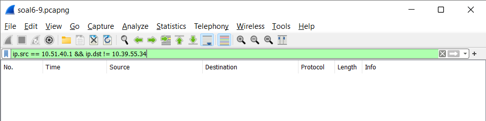

Perolehan flag :

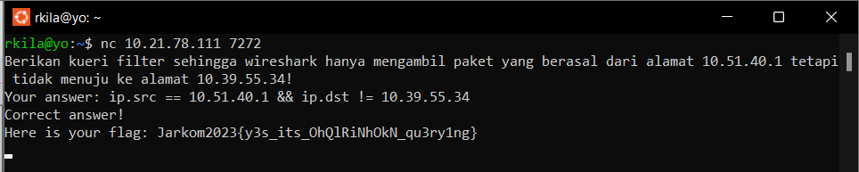

Kendala : tidak ada.

# No. 10
### Soal
Sebutkan kredensial yang benar ketika user mencoba login menggunakan Telnet

### Penyelesaian
Menggunakan display filter tcp
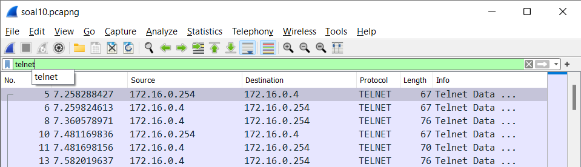

Follow TCP Stream
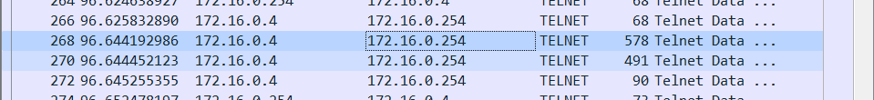

Baca username dan password
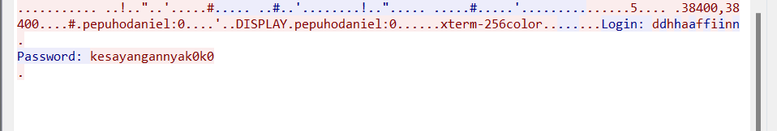

Bedah username berdasarkan warna menjadi biru dan merah yaitu dhafin dan dhafin, lalu masukkan lagi ke nc

perolehan flag :

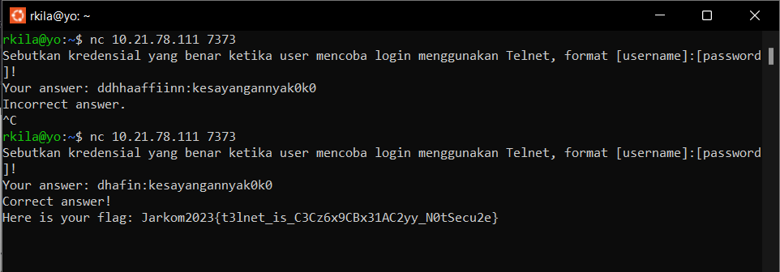

Kendala : tidak ada.
